# PHP Dasar 1

## Menampilkan text di layar
```php
    <h1>Belajar PHP dasar</h1>
    <?php 
        echo "Hello World!";
    ?>
```
### Output
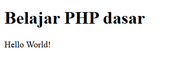

<hr>

## Variabel
```php
    <h1>Menggunakan Variable</h1>
    <?php 
        $nim = "312410425";
        $nama = "Fathan";
        echo "NIM : " . $nim . "<br>";
        echo "Nama : $nama";
    ?>
```
### output
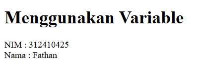

<hr>

## Form Input (simpel)
```php
    <h2>Form Input</h2>
    <form method="post">
        <label>Nama: </label>
        <input type="text" name="nama">
        <input type="submit" value="Kirim">
    </form>
    <?php 
        echo 'Selamat Datang ' . $_POST['nama'] . '!';
    ?>
```
### output
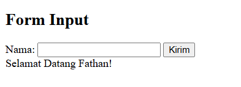

<hr>

# PHP Dasar 2

## Operasi
```php
    <div style="border: 2px solid black; padding: 20px; margin-bottom: 20px;">
        <h1>Operasi</h1>
        <?php
            $gaji = 1000000;
            $pajak = 0.1;
            $thp = $gaji - ($gaji*$pajak);
            echo "Gaji sebelum pajak = Rp. $gaji <br>";
            echo "Gaji yang dibawa pulang = Rp. $thp";
        ?>
    </div>
```
### output
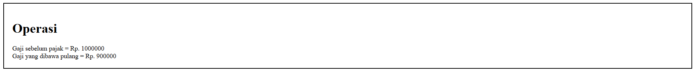

<hr>

## Kondisi IF
```php
    <div style="border: 2px solid black; padding: 20px; margin-bottom: 20px;">
        <h1>Kondisi IF</h1>
        <?php
        $nama_hari = date("l");
        if ($nama_hari == "Sunday") {
            echo "Minggu";
        } elseif ($nama_hari == "Monday") {
            echo "Senin";
        } else {
            echo "Selasa";
        }
        ?>
    </div>
```
### output
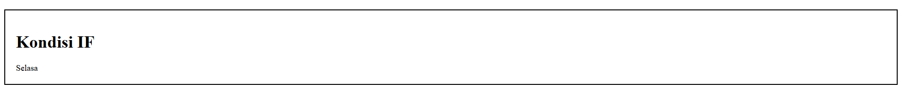

<hr>

## Kondisi Switch
```php
    <div style="border: 2px solid black; padding: 20px; margin-bottom: 20px;">
        <h1>Kondisi Switch</h1>
        <?php
            $nama_hari = date("l");
            switch ($nama_hari) {
                case "Sunday":
                    echo "Minggu";
                    break;
                case "Monday":
                    echo "Senin";
                    break;
                case "Tuesday":
                    echo "Selasa";
                        break;
                default:
                    echo "Sabtu";
            }
        ?>
    </div>
```
### output
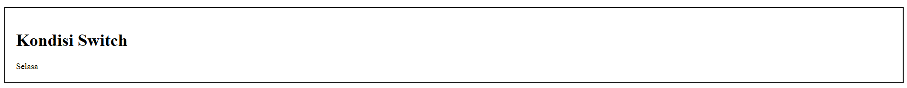

<hr>

## Perulangan for
```php
    <div style="border: 2px solid black; padding: 20px; margin-bottom: 20px;">
        <h1>Perulangan for</h1>
        <?php
        echo "Perulangan 1 sampai 10 <br />";
        for ($i=1; $i<=10; $i++) {
            echo "Perulangan ke: " . $i . '<br />';
        }
        echo "Perulangan Menurun dari 10 ke 1 <br />";
        for ($i=10; $i>=1; $i--) {
            echo "Perulangan ke: " . $i . '<br />';
        }
        ?>
    </div>
```
### output
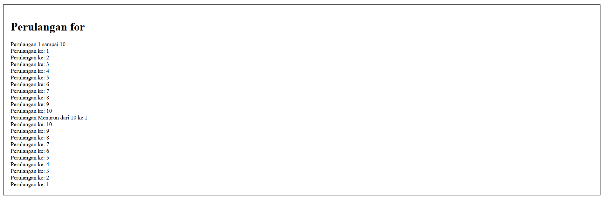

<hr>

## Perulangan while
```php
    <div style="border: 2px solid black; padding: 20px; margin-bottom: 20px;">
        <h1>Perulangan while</h1>
        <?php
        echo "Perulangan 1 sampai 10 <br />";
        $i=1;
        while ($i<=10) {
            echo "Perulangan ke: " . $i . '<br />';
            $i++;
        }
        ?>
    </div>
```
### output
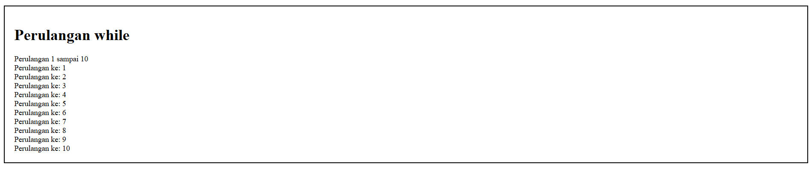

<hr>

## Perulangan dowhile
```php
    <div style="border: 2px solid black; padding: 20px; margin-bottom: 20px;">
        <h1>Perulangan dowhile</h1>
        <?php
        echo "Perulangan 1 sampai 10 <br />";
        $i=1;
        do {
        echo "Perulangan ke: " . $i . '<br />';
        $i++;
        } while ($i<=10);
        ?>
    </div>
```
### output
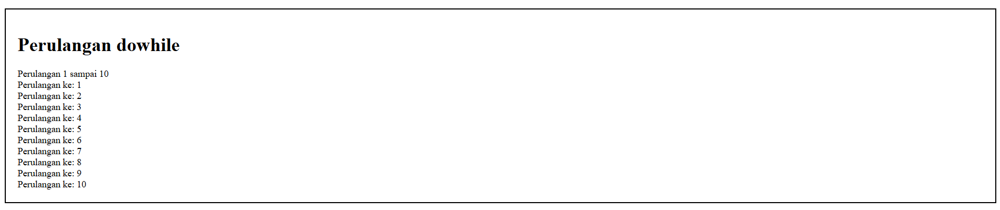

<hr>

# Praktikum

## Form Input
```php
    <h2>Form Input Data</h2>
    <form method="post" action="">
        Nama: <input type="text" name="nama" required><br><br>
        Tanggal Lahir: <input type="date" name="tgl_lahir" required><br><br>
        Pekerjaan:
        <select name="pekerjaan" required>
            <option value="Programmer">Programmer</option>
            <option value="Desainer">Desainer</option>
            <option value="Guru">Guru</option>
            <option value="Dokter">Dokter</option>
        </select><br><br>
        <input type="submit" name="submit" value="Kirim">
    </form>
```

## Form Output
```php
    <?php
    if (isset($_POST['submit'])) {  
        $nama = $_POST['nama'];
        $tgl_lahir = $_POST['tgl_lahir'];
        $pekerjaan = $_POST['pekerjaan'];

        $umur = date_diff(date_create($tgl_lahir), date_create('today'))->y;

        switch ($pekerjaan) {
            case "Programmer":
                $gaji = 10000000;
                break;
            case "Desainer":
                $gaji = 8000000;
                break;
            case "Guru":
                $gaji = 6000000;
                break;
            case "Dokter":
                $gaji = 12000000;
                break;
            default:
                $gaji = 5000000;
                break;
        }

        echo "<hr>";
        echo "<h3>Output Data</h3>";
        echo "Nama: $nama <br>";
        echo "Tanggal Lahir: $tgl_lahir <br>";
        echo "Umur: $umur tahun <br>";
        echo "Pekerjaan: $pekerjaan <br>";
        echo "Gaji: Rp " . number_format($gaji, 0, ',', '.') . "<br>";
    }
    ?>
```
### Hasil Akhir
#### Input
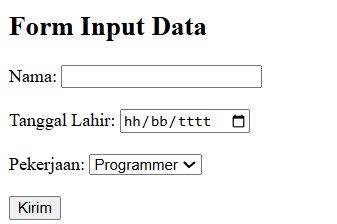
#### Output
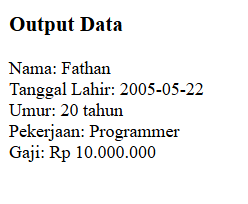
